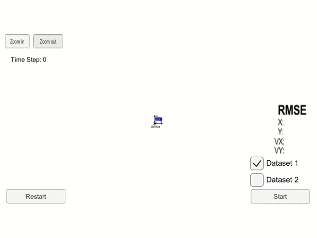
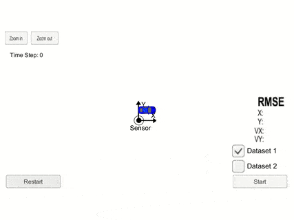
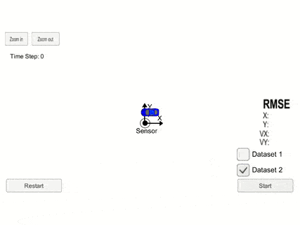

# Extended Kalman Filter
[](LICENSE) [](https://www.codacy.com/manual/frgfm/sdcnd-p5-extended-kalman-filter?utm_source=github.com&amp;utm_medium=referral&amp;utm_content=frgfm/sdcnd-p5-extended-kalman-filter&amp;utm_campaign=Badge_Grade)  

Extended Kalman Filter project of Udacity Self-Driving Car Engineer




## Table of Contents

- [Getting Started](#getting-started)
  - [Prerequisites](#prerequisites)
  - [Installation](#installation)
- [Usage](#usage)
- [Approach](#Approach)
- [Credits](#credits)
- [License](#license)


## Getting started

### Prerequisites

- [Unity3D](https://unity3d.com/get-unity/download): 3D game engine used for our simulation.
- make (>= 4.1 on Linux, Mac, >= 3.81 on Windows): the buildsystem of the project.
  - Linux: make is installed by default on most Linux distros
  - Mac: [install Xcode command line tools to get make](https://developer.apple.com/xcode/features/)
  - Windows: [Click here for installation instructions](http://gnuwin32.sourceforge.net/packages/make.htm)
- [cmake](https://cmake.org/install/) 3.5 (or newer): buildsystem generator.
  - Any OS: [click here for installation instructions](https://cmake.org/install/)
- [gcc](https://gcc.gnu.org/)/g++ 5.4 (or newer): to compile the C++ code.
  - Linux: gcc / g++ is installed by default on most Linux distros
  - Mac: same deal as make - [install Xcode command line tools](https://developer.apple.com/xcode/features/)
  - Windows: recommend using [MinGW](http://www.mingw.org/)
- [uWebSockets 0.13.0](https://github.com/uNetworking/uWebSockets/archive/v0.13.0.tar.gz): to handle our web-server.
  - Linux/Mac: [click here for installation instructions](https://github.com/uWebSockets/uWebSockets)
  - Windows: use either Docker, VMware, or even [Windows 10 Bash on Ubuntu](https://www.howtogeek.com/249966/how-to-install-and-use-the-linux-bash-shell-on-windows-10/) to install uWebSocketIO
- [json](https://github.com/nlohmann/json): to interact with JSON files *(header-only)*.
  - Any OS: place the [file](https://github.com/nlohmann/json/releases/download/v3.7.3/json.hpp) in the  `include/` folder
- [Eigen](https://gitlab.com/libeigen/eigen): for linear algebra *(header-only)*.
  - Any OS: extract the [archive](https://gitlab.com/libeigen/eigen/-/archive/3.3.7/eigen-3.3.7.tar.gz) and place the `Eigen` directory in the  `include/` folder
- [Catch](https://github.com/catchorg/Catch2): for unittests *(header-only)*
  - Any OS: place the [file](https://github.com/catchorg/Catch2/releases/download/v2.11.3/catch.hpp) in the `lib/` folder
- [spdlog](https://github.com/gabime/spdlog): for console logging *(header-only)*
  - Any OS: extract the [archive](https://github.com/gabime/spdlog/archive/v1.5.0.tar.gz) and place the `include/spdlog` directory in the  `include/` folder

*Note: If you are running a Unix system, the installation scripts in the folder `scripts/` will install all the requirements apart from Unity3D. From the repository's main directory, run `bash scripts/install-linux.sh` for Linux or run `bash scripts/install-mac.sh` for MacOS to install those dependencies.*

### Installation

#### C++

Your folder hierarchy should look like below:

```
.
├── CMakeLists.txt
├── include
│   ├── Eigen
│   ├── json.hpp
│   └── spdlog
├── lib
│   └── catch.hpp
├── LICENSE
├── README.md
├── scripts
│   ├── install-cppdeps.sh
│   ├── install-linux.sh
│   └── install-mac.sh
├── src
│   ├── FusionEKF.cpp
│   ├── FusionEKF.h
│   ├── kalman_filter.cpp
│   ├── kalman_filter.h
│   ├── main.cpp
│   ├── measurement_package.h
│   ├── tools.cpp
│   └── tools.h
├── static
│   └── images
└── test
    ├── main_test.cpp
    └── tools_test.cpp
```

Now you can build the project:

```bash
mkdir build && cd build
cmake .. && make && cd ..
```


#### Unity

After installing Unity3D, you will need an environment build to run the simulation. Download the appropriate build for your OS and extract it:

- [Linux](https://github.com/udacity/self-driving-car-sim/releases/download/v1.45/term2_sim_linux.zip)
- [Mac](https://github.com/udacity/self-driving-car-sim/releases/download/v1.45/term2_sim_mac.zip)
- [Windows](https://github.com/udacity/self-driving-car-sim/releases/download/v1.45/term2_sim_windows.zip)

If you encounter an issue with the above builds, please refer to the "Available Game Builds" section of this [readme](https://github.com/udacity/self-driving-car-sim).


## Usage

### Unittests

By compiling the project previously, you created 2 executables. One of them is here to run unittests using [Catch2](https://github.com/catchorg/Catch2). In order to run the tests, use the following command:

```bash
build/tests
```

which should yield something similar to:

```shell
[2020-03-27 12:28:17.342] [warning] Invalid argument dimensions - received sizes 0 and 1
[2020-03-27 12:28:17.343] [warning] Invalid argument dimensions - received sizes 1 and 0
[2020-03-27 12:28:17.343] [warning] Invalid argument dimensions - received sizes 2 and 1
[2020-03-27 12:28:17.343] [warning] Invalid state vector size - expected 4, received 2
[2020-03-27 12:28:17.343] [warning] Invalid measurement values - division by zero
===============================================================================
All tests passed (21 assertions in 2 test cases)
```


### Project build

Run the recently built project using the following command:

```
build/ExtendedKF
```

The compiled program is now listening to events on port `4567` using a web server. We just need to run our Unity3D environment to see the results.

- Run the `term2_sim` executable after extracting the environment archive *(you might have to make it executable on Unix systems)*.
- Select the Resolution and Graphics settings for your setup.
- Click on `SELECT`
- Click on `Start`


## Approach

This project has the particularity of using simulated data for  evaluation, which easily solves the costs of collecting and annotating the data. The environment is not interactive for the user, the only accepted input is the prediction of position and velocity in 2D.

### Environment

This Unity environment offers a dynamic motion measurement session over a car trajectory using several sensors with two datasets. 

| Dataset 1                               | Dataset 2                               |
| --------------------------------------- | --------------------------------------- |
|  |  |

Both datasets include measurements from radar and LIDAR sensors. The environment will have the car follow a predefined trajectory and will expose the sensor measurements to our C++ program.

Please refer to this [repository](https://github.com/udacity/self-driving-car-sim) for further details.


### Implementing an EKF

We follow the description of the Kalman Filter algorithm in its extended version, to accommodate non-linear motion.


In the `src` folder, you will find:

- `main.cpp`: reads measurement data from Unity3D, runs the EKF and evaluate the predictions.
- `FusionEKF.cpp`: initializes the filter, triggers the prediction and measurement update.
- `kalman_filder.cpp`: implements the prediction step and measurement update.
- `tools.cpp`: implements RMSE and Jacobian matrix computation.


### Results

The previously mentioned implementation yields good performances in regards to RMSE on the state vector, and the prediction visualized in green reflects accurately the motion of the car.


The implementation is evaluated using the [RMSE](https://en.wikipedia.org/wiki/Root-mean-square_deviation) on the state vector component over the datasets.

| State | Dataset 1 | Dataset 2 |
| ----- | --------- | --------- |
| Px    | 0.1377    | 0.1071    |
| Py    | 0.0864    | 0.1044    |
| Vx    | 0.4805    | 0.4433    |
| Vy    | 0.4001    | 0.4582    |

Full-length lap recordings in bird-eye view are available for download in the release attachments:

- [Dataset 1](https://github.com/frgfm/sdcnd-p5-extended-kalman-filter/releases/download/v0.1.0/dataset1_result.mp4)
- [Dataset 2](https://github.com/frgfm/sdcnd-p5-extended-kalman-filter/releases/download/v0.1.0/dataset2_result.mp4)


## Limitations and improvements

Now, our current filter runs with two sensors' information. Let us investigate the performances if we only keep one sensor information. You can do so by modifying the `radar_enabled_` and `laser_enabled_` values over [here](https://github.com/frgfm/sdcnd-p5-extended-kalman-filter/blob/ci-setup/src/FusionEKF.cpp#L22-L23) and recompile the project.


RMSE using only Radar

| State | Dataset 1 | Dataset 2 |
| ----- | --------- | --------- |
| Px    | 0.2549    | 0.2924    |
| Py    | 0.3479    | 0.3881    |
| Vx    | 0.6409    | 0.6219    |
| Vy    | 0.7622    | 0.8388    |


RMSE using only LIDAR

| State | Dataset 1 | Dataset 2 |
| ----- | --------- | --------- |
| Px    | 0.2370    | 0.1558    |
| Py    | 0.1144    | 0.1550    |
| Vx    | 0.8279    | 0.6908    |
| Vy    | 0.5217    | 0.6126    |


## Credits

This implementation is vastly based on the following methods:

- Kalman Filter: [Contributions to the Theory of Optimal Control (1960)](https://citeseerx.ist.psu.edu/viewdoc/download;jsessionid=A135C4BFE0816EE51803D4A084B65CBB?doi=10.1.1.26.4070&rep=rep1&type=pdf), [A New Approach to Linear Filtering and Prediction Problems (1960)](https://www.cs.unc.edu/~welch/kalman/media/pdf/Kalman1960.pdf) 


## License

Distributed under the MIT License. See `LICENSE` for more information.